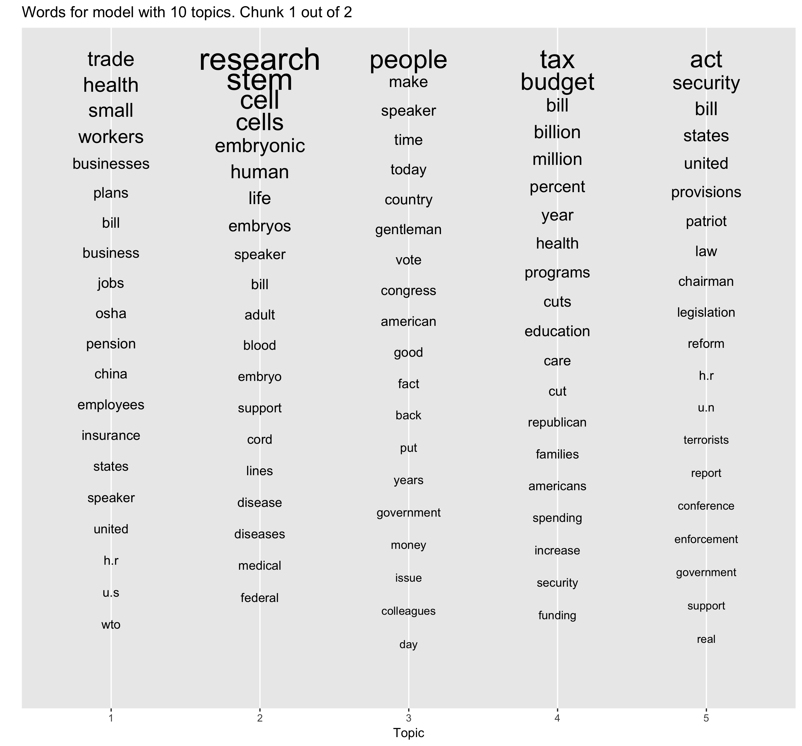
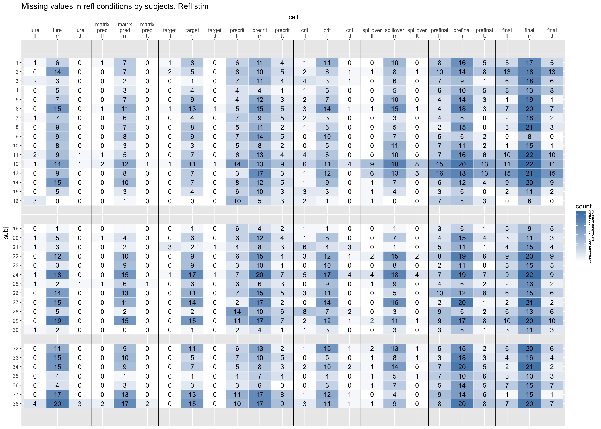

# Data visualization examples

This repo is intended to demonstrate some of the plots I have produced during my research. I try to give brief explanations for each of them, but exposing sufficient background and motivations behind some of the projects here is far beyond the scope of this repo. 

The code and data used to make the plots are available, when possible. For most of the projects, these will sit in the subdirectories within this repo. If it's not the case, the description of the project will give links to relevant resources or explain why it is hard/impractical to post data here. 

-------

## 1. Drug overdose deaths visualization

This is a plot based on a CDC dataset about deaths caused by drug overdose, available [here](https://data.cdc.gov/NCHS/VSRR-Provisional-Drug-Overdose-Death-Counts/xkb8-kh2a). 

The plot visualizes the proportion of drug related deaths to the overall number of deaths for each state. The top left facet represents a baseline: propotion of drug related deaths in a 12 months period from Sep 2014 to Aug 2015. Each of the next two plots represents the change in this proportion relative to the previous 12-month period. 

Two things stand out: First, the states with high proportions of drug related deaths are mostly concentrated on the East and West of the country. Of course, this is were the population is concentrated, but since we are looking at proportions, the differences in the baseline for the population size would have been already accounted for to some degree. Second, the states on the East Coast, especially Maryland and West Virginia (as well as DC), seem to have an increase in the proportion of drug related deaths for the last couple of years.

For a more detailed discussion of the dataset, see my repo [here](https://github.com/antonmalko/OD-deaths-visualization).

-------

## 2. Exploring topic modeling

This plot comes from an exploratory/learning project on topic modeling. Fuller description of the project, and the corresponding scripts can be found [here](https://github.com/antonmalko/convote_sotu_topics).

The plot represents the results of topic modeling of texts from a corpus of [Congressional speech data](https://www.cs.cornell.edu/home/llee/data/convote.html). Topic modelling is done using [Mallet](http://mallet.cs.umass.edu/). In this particular case, `Mallet` was trying to discover 10 topics, and 5 of them are shown on the plot. 

(The idea for the format of the plot was taken from [here](https://de.dariah.eu/tatom/topic_model_visualization.html); however, I re-implemented the whole code from scratch in R (the original post is in Python)).

Each position on the X axis represents a topic discovered by `Mallet`; on the Y axis, the words are arranged from most to least frequent within a particular topic (counting from the top of the plot). The size of the font represents the proportion of the word in a topic. (Frequency per se doesn't tell *how much* more frequent a word is - maybe it occurs only 1-2 times more than the secod most frequent word, or maybe it's ahead by thousands of mentions. Plotting proportion information helps in getting a feel of this).

The model is pretty good at discovering sensible topics: e.g. topic 2 is quite clearly relates to medicine and health, topic 4 contains words related to budget and finance, and topic 5 - words about laws and security.

-------

## 3. Reaction times in reading experiments

This example comes from a research project which investigates how number and gender are represented in the (linguistic) mind. In brief, the results may be taken to suggest that some nouns (plural nouns in English, masculine nouns in Russian have a more stable representation in memory, affecting how we understand sentences in real-time.  A full report on the project can be found [here](http://ling.umd.edu/~amalko/docs/Slioussar&Malko2016.pdf). 

A brief (oversimplifed) explanation

It is hypothesized that in English plural nouns are somehow more prominent than singular ones. One testimony to this is that native English speakers often do not notice agreement mistakes like "**The key** to the cabinets **are** rusty", but mistakes like "**The keys** to the cabinet **is** rusty" are much more noticeable. Plural nouns "attract" hearer's attention, which would lead to the verb being connected to a wrong noun ("cabinets") in the first sentence, but to the right one ("keys") in the second. This is known as "agreement attraction".

Now, English only has two numbers: singular and plural. But what would happen if we were dealing with more than two features? Would only one of them "stand out"? Would there be gradient effects? This project investigates this by looking at gender in Russian, which indeed has three values: masculine, feminine and neuter (but purely for the sake of explanation, I will make examples in terms of number below). 

The plots below show the results of an experiment, in which people are asked to read a sentence word-by-word, pressing a key to uncover each following word. The time it takes for the readers to press the button is taken to be indicative of how easily they understand the sentence: if it easy, they will proceed quickly, but if it is hard, they may slow down. Thus, if we make them read sentences like "**The key** to the cabinets **are** rusty", people would **not** slow down while reading the verb "are" if they don't notice the mistake.

At the plots below, the X axis represents the position of a word in the sentence, the Y axis represents average time people took to move from word N to word N+1. Blue lines represent sentences without mistakes, serving as a baseline. Red lines represent sentences with mistakes, with darker lines being sentences like "The key to the cabinet is rusty", where neither noun matches the verb (and where we expect people to struggle). The lighter lines are sentences of interest (of the type "The key to the cabinets are rusty").
Each panel represents different combination of genders ("head" is the first noun, "attractor" is the second noun).

The pattern we expect to see if gender in Russian behaves like number in English is two blue lines laying low (i.e. correct sentences are read quickly), the dark red line showing a spike (indicating people struggling with the verb whihc doesn't match any noun in the sentence), and the light red line laying somewhere in between (indicating that sentences like **The key** to the cabinets **are** rusty" do not cause that much of a processing difficulty).

Indeed, this is the pattern we observe for sentences with *non-masculine* (i.e. feminine or neuter) first noun (two left panels). However,it is much harder to claim that this pattern holds for sentences with masculine first noun (two right panels). This suggests (together with some more results, described in the full report) that there is something special about masculine nouns, so that, when they are the subject, people become "immune" to the influence of any other potentially distracting nouns in the same sentence (i.e. "immune" to agreement attraction).

---------

## 4. Data exploration helper plots

This plot comes analysis of eye-tracking while reading data. In such studies, people read sentences, while their eye movements are recorded. This plot is used during exploratory data analysis of such data and answers the question: did participants skip particular words, and if so, which participants and how often?

This plot is build using functions from [this](https://github.com/antonmalko/ettools) package of mine (in particular, `report_NAs_count()`). I do not include the full data used to generate this plot (it requires quite a big number of other pre-processing steps, specific to the study it comes from), but I do inlcude a toy example with a code which would generate a similar plot.

Details on how to read the plot

During the data analysis, the sentences are broken down to "regions" - groups of words we are interested in. Several reading measures are computed; e.g. in this plot, there are three (simplifying their definitions): *first fixation* - duration of the very first look at the region; *re-read* - time people spend in the region when they return there from other regions; *total times* - total time people spend reading the region. 

Before doing anything interesting with these data, we need to know some general facts about people's reading styles. E.g. did they skip some regions, and if so, which and how often? This is the question that this plot answers.

The plot is a heatmap indicating the number of missing values per region per reading measure for each participant. Participants are enumerated along the Y axis; if a participant is missing from the data, there is a "gap" in the map (here, fpr participants 17, 18 and 31). Combinations of regions and reading measures are listed along the X axis (what specific regions are in this particular study is not that important). There are three reading measure computed for each region, that's why black lines delimit groups of three columns (corresponding to a single sentence region). Color intensity codes the number of missing values for a particular region, reading measure and participant; the numbers in the cell indicate the exact number of missing values. 

For this particular plot, we are interested to see whether there are many skips in "ff" (first fixations - corresponding to the cases where people skipped over the region during initial skimming of the sentence) and in "tt" (total times - corresponding to the situations where people skipped a region entirely). These are the first and the third columns for each region, and since in this plot they mostly are white to light blue (corresponding to low numbers of skips), we conclude that the data is of good quality and we can proceed with further analyses. 

